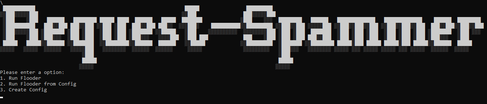

# Request-Spammer
Request-Spammer is a tool that send alot of GET/POST reqest with data to an specific server 


## Example


## Installation
* Clone the repo:
```sh
git clone https://github.com/TepMaster/Request-Spammer
cd Depix
```
* Install the dependencies:
```sh
python -m pip install -r requirements.txt
```
* Run Request-Spammer:
```python
python main.py
```

## Example usage

Run the app select your request type target URL data and the number of time the request will be sent and press enter
Example: 

* Depixelize example image created with Sublime and pixelized with Gimp, where averaging is done in linear sRGB. The backgroundcolor option filters out the background color of the editor.
```
python3 depix.py -p images/testimages/sublime_screenshot_pixels_gimp.png -s images/searchimages/debruin_sublime_Linux_small.png --backgroundcolor 40,41,35 --averagetype linear
```
Result: 

## About
### Making a Search Image
* Cut out the pixelated blocks from the screenshot as a single rectangle.
* Paste a [De Bruijn sequence](https://en.wikipedia.org/wiki/De_Bruijn_sequence) with expected characters in an editor with the same font settings as your input image (Same text size, similar font, same colors).
* Make a screenshot of the sequence.
* Move that screenshot into a folder like `images/searchimages/`.
* Run Depix with the `-s` flag set to the location of this screenshot.

### Known limitations

* The speed is limited by your internet connection and the setting use. An average internet connection the program send 20-30 request per second it can be future increases to 50-100/s but is Captcha is present the speed is limited by the Captcha solver provider


### Future development

* Add Captcha Support via RuCaptcha
* Tor 
* Random Name/Email/Phone
* Changeable Browser Agents
* Make a executable verison
