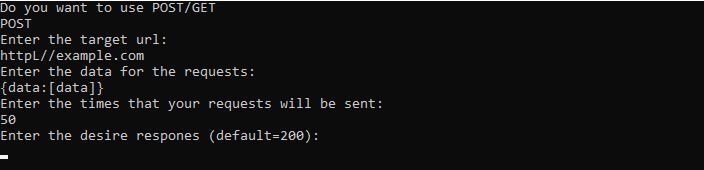

# Request-Spammer
Request-Spammer is a tool that send alot of GET/POST reqest with data to an specific server 


## Example


## Installation
* Clone the repo:
```sh
git clone https://github.com/TepMaster/Request-Spammer
cd Request-Spammer
```
* Install the dependencies:
```sh
python -m pip install -r requirements.txt
```
* Run Request-Spammer:
```python
python main.py
```

## Example usage

Run the app select your request type target URL data and the number of time the request will be sent and press enter


To make a config file use option 3 and for running the script from the config file use option 2 and specify the number of time to request needs to be sent
## About


### Known limitations

* The speed is limited by your internet connection and the setting use. An average internet connection the program send 20-30 request per second it can be future increases to 50-100/s but is Captcha is present the speed is limited by the Captcha solver provider


### Future development

* Add Captcha Support via RuCaptcha
* Tor 
* Random Name/Email/Phone
* Changeable Browser Agents
* Make a executable verison
